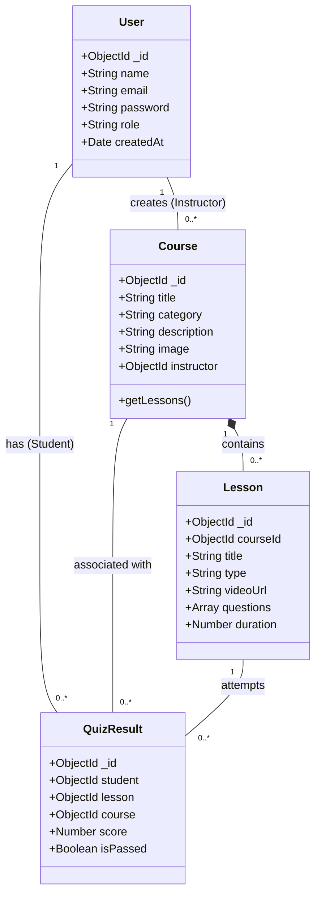
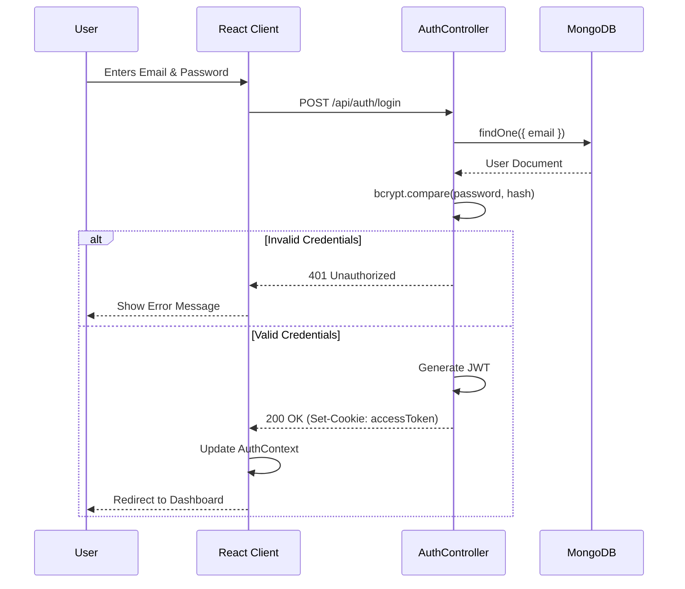
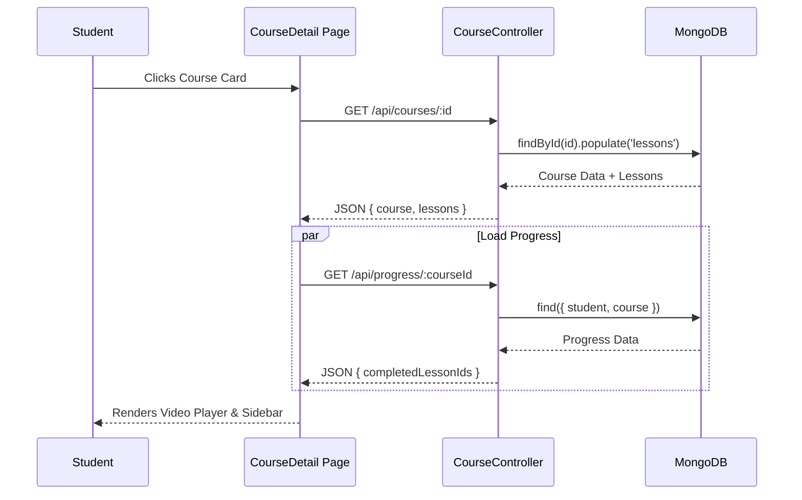
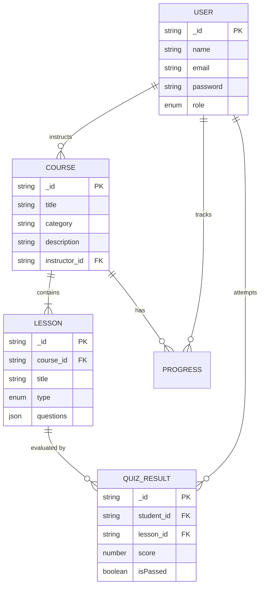

# LMS Project UML Diagrams

## 1. Use Case Diagram
**Description:** This diagram illustrates the interactions between different user roles (Actors) and the system's functionalities.
-   **Student:** Can browse courses, watch lessons, and take quizzes.
-   **Instructor:** Can manage courses and view their own analytics.
-   **Admin:** Has full control over users and system-wide visibility.

```mermaid
usecaseDiagram
    actor Student
    actor Instructor
    actor Admin

    package "LMS System" {
        usecase "Login / Register" as UC1
        usecase "View Profile" as UC2
        usecase "Browse Courses" as UC3
        usecase "Watch Lessons" as UC4
        usecase "Take Quiz" as UC5
        usecase "Create / Edit Course" as UC6
        usecase "Manage Users" as UC7
        usecase "View Analytics" as UC8
        usecase "View My Performance" as UC9
    }

    Student --> UC1
    Student --> UC2
    Student --> UC3
    Student --> UC4
    Student --> UC5
    Student --> UC9

    Instructor --> UC1
    Instructor --> UC2
    Instructor --> UC6
    Instructor --> UC8

    Admin --> UC1
    Admin --> UC7
    Admin --> UC8
```

## 2. Class Diagram (Domain Model)
**Description:** Represents the static structure of the database models and their relationships.
-   **User:** Base entity for all roles.
-   **Course:** Contains metadata and is linked to an Instructor.
-   **Lesson:** Belongs to a Course and can contain Quiz questions.
-   **QuizResult:** Tracks a Student's performance on a specific Lesson (Quiz).



## 3. Sequence Diagrams

### 3.1 Login Process
**Description:** Detailed flow of authentication where the client sends credentials and receives a JWT token via an HTTP-only cookie.



### 3.2 View Course Details
**Description:** How the system retrieves course information and specific user progress when a student opens a course page.



## 4. Entity-Relationship (ER) Diagram
**Description:** Visualizes the database schema for the MERN stack application. It highlights the *One-to-Many* relationships between Instructors and Courses, and Courses and Lessons.


